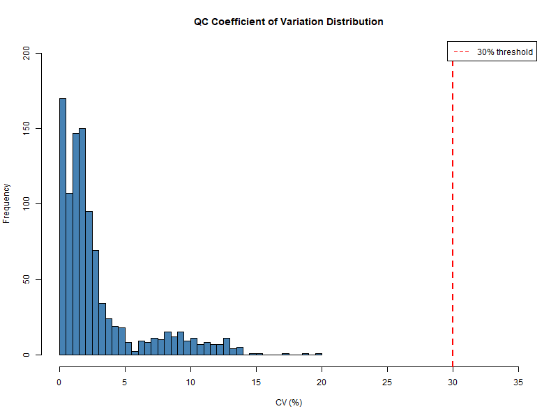
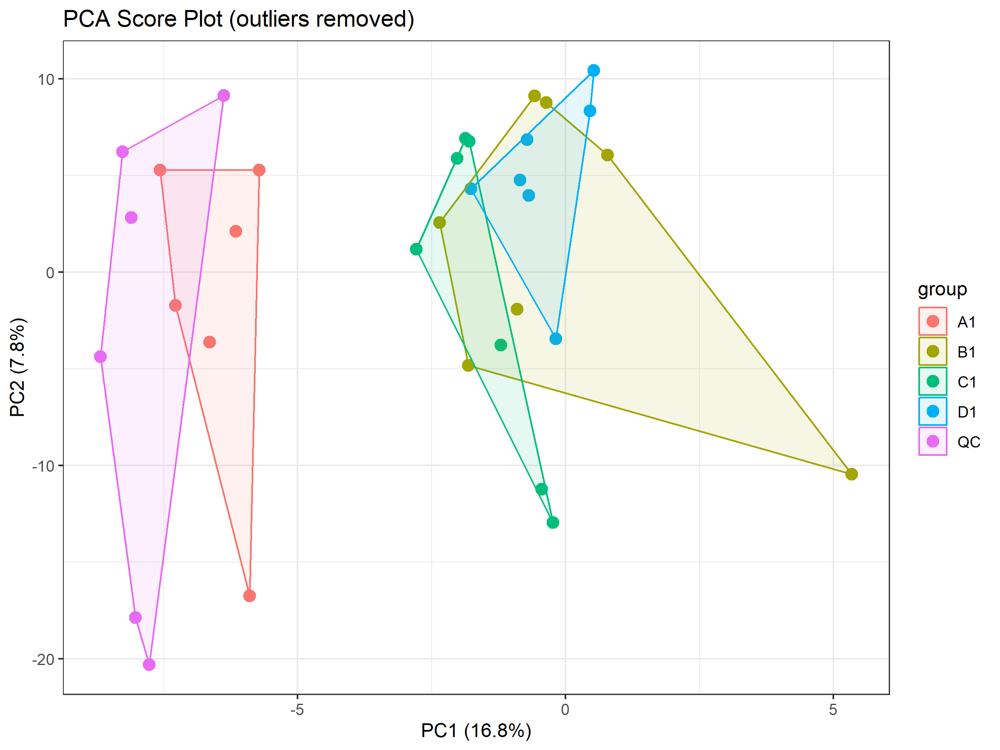
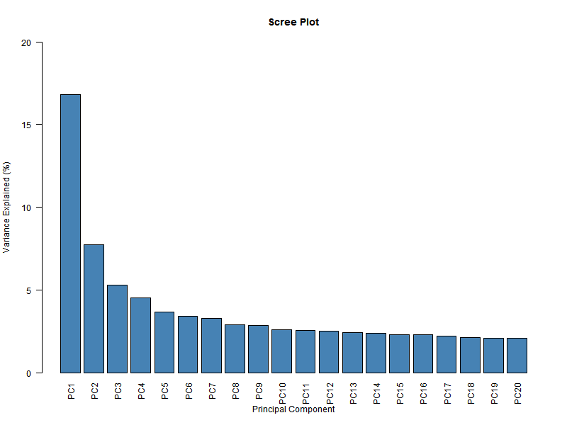
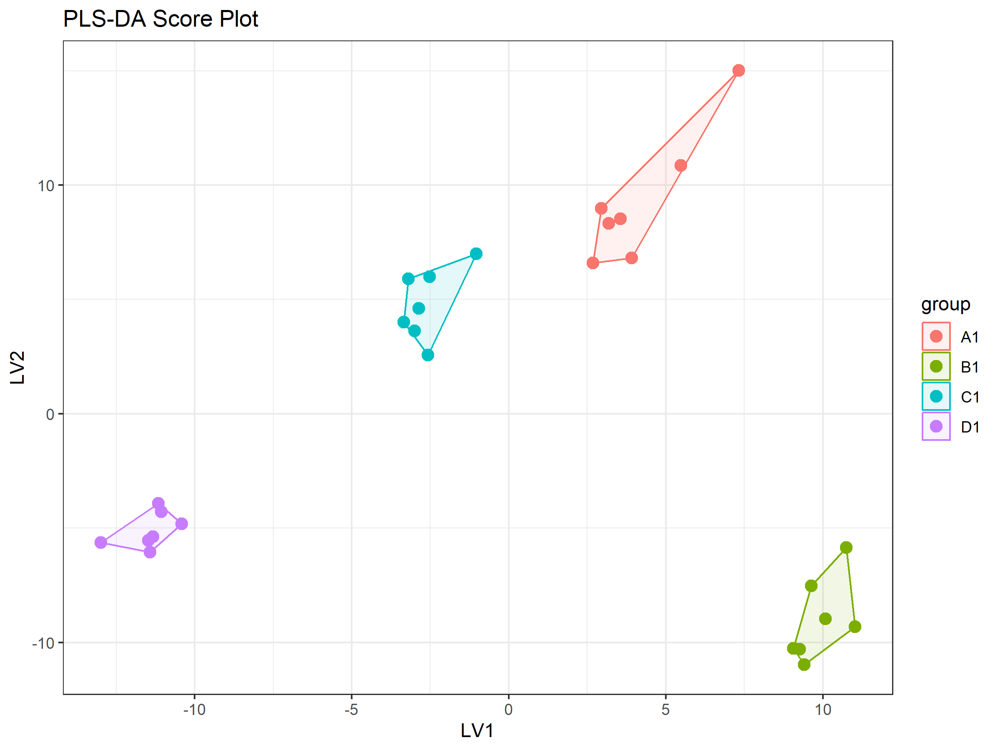
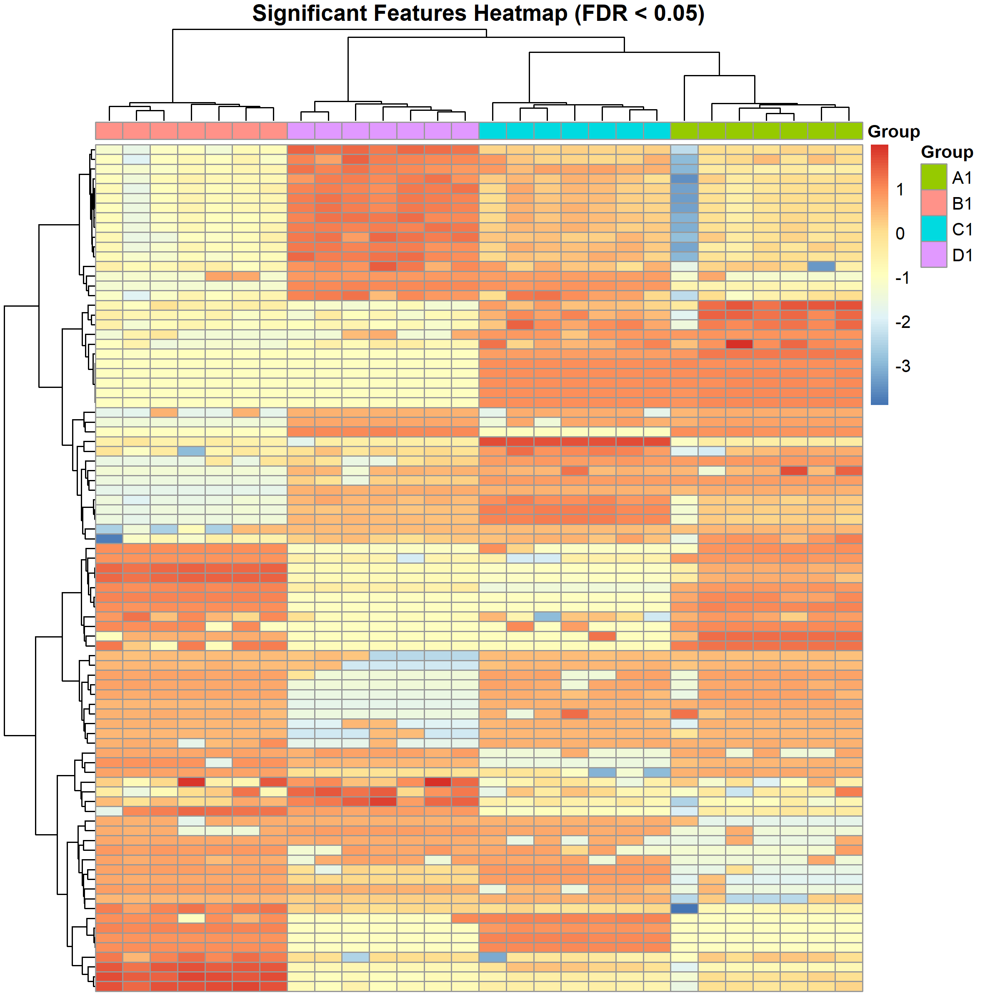

# E. coli Untargeted Metabolomics Analysis
### LC-MS Feature Extraction · Probabilistic Annotation · Statistical Analysis
*By Daniel Ghali — PhD Application Computational Assessment*

---

## Overview

This project presents a full untargeted LC-MS metabolomics analysis of *Escherichia coli* cultures, processing raw mass spectrometry data through to biologically interpreted metabolite annotations and statistical group comparisons. The pipeline integrates feature extraction, probabilistic annotation, biological prior knowledge, pathway-driven biochemical connections, and comprehensive statistical analysis.

The dataset is publicly available at [Zenodo (record 3414903)](https://zenodo.org/records/3414903). Analysis was restricted to the `.mzML` files in `Supplementary_data_3/raw_data_POS`.

---

## Analysis Pipeline

```
Raw .mzML files
      │
      ▼
1. XCMS Preprocessing        ── Peak picking, RT alignment, feature extraction
      │
      ▼
2. Baseline Annotation        ── ipaPy2 MS1 probabilistic annotation
      │
      ▼
3. Context-Aware Annotation   ── ECMDB prior knowledge integration
      │
      ▼
4. Pathway-Driven Annotation  ── KEGG biochemical connections via Gibbs sampler
      │
      ▼
5. Statistical Analysis       ── QC assessment, PCA, PLS-DA, ANOVA
```

---

## Step 1 — Feature Extraction & Preprocessing (XCMS)

Raw LC-MS data from 35 samples (28 biological + 7 QC pooled) was processed using the XCMS R package.

**Key decisions:**

- **Peak picking:** CentWave algorithm with default parameters, well-validated for high-resolution LC-MS data. Parameter optimisation tools such as IPO exist for production analyses but default settings are appropriate here.
- **Retention time alignment:** Aligned using QC samples only (`minFraction=0.8`, loess smoothing). Using QC samples as alignment anchors prevents correcting for genuine biological differences and ensures only analytical drift is removed.
- **Feature selection:** Features were first filtered to remove those detected in ≤50% of samples. Remaining features were scored by `detection rate × log₁₀(mean intensity)` and the top 1000 selected. Multiplying rather than adding ensures both criteria must be satisfied — a feature needs high signal AND consistent detection. This is particularly important for ipaPy2, which relies on isotope clusters and adduct relationships that require well-detected, high-intensity features.
- **Output format:** Intensity matrix exported as CSV with m/z and retention time attributes for direct Python compatibility.

| Stat | Value |
|------|-------|
| Total samples | 35 (28 biological + 7 QC) |
| Biological groups | 4 (A1, B1, C1, D1) |
| Features selected | 1,000 |
| Min. detection rate | >50% |

---

## Step 2 — Baseline Annotation (ipaPy2)

Metabolic features were annotated using [ipaPy2](https://github.com/francescodc87/ipaPy2) (Integrated Probabilistic Annotation).

**Pipeline:**
1. Cluster features by isotope patterns (`map_isotope_patterns`)
2. Compute all adducts against the IPA_MS1 database (positive mode)
3. MS1 annotation: match features to candidates within 3 ppm
4. Gibbs sampler (adducts only): 1000 iterations, δ=0.1

**Why this feature selection matters for ipaPy2:** Features selected by detection rate × intensity are more likely to form complete isotope patterns and reliable adduct connections, directly maximising annotation quality.

**Example baseline annotation output (top 5 by post Gibbs score):**

| Rank | Name | Formula | Adduct | Post Gibbs |
|------|------|---------|--------|-----------|
| 1 | D-Leucine | C6H14NO2 | M+H | 0.111 |
| 2 | D-allo-Isoleucine | C6H14NO2 | M+H | 0.093 |
| 3 | L-Leucine | C6H14NO2 | M+H | 0.092 |
| 4 | D-Isoleucine | C6H14NO2 | M+H | 0.082 |
| 5 | Leucine | C6H14NO2 | M+H | 0.078 |

At baseline, isobaric amino acids are nearly indistinguishable — annotation confidence is distributed evenly across candidates.

---

## Step 3 — Context-Aware Annotation (ECMDB Prior)

The [E. coli Metabolome Database (ECMDB)](https://ecmdb.ca/) was used to integrate biological prior knowledge into the annotation.

**Strategy:** Metabolites present in ECMDB are assumed to be part of *E. coli* metabolism and therefore more likely to be present in the dataset. This prior is encoded in the ipaPy2 `pk` parameter.

**Mapping challenge:** Databases use different identifiers. Dual matching via KEGG ID and InChIKey was used to maximise coverage between the IPA_MS1 database and ECMDB.

| Match Type | Prior (pk) |
|-----------|-----------|
| KEGG ID match | 1.0 (highest) |
| InChIKey match | 0.95 |
| No match | 0.5 (default) |

**Effect on annotation (top 5 by post Gibbs score after ECMDB prior):**

| Rank | Name | Formula | Adduct | Post Gibbs |
|------|------|---------|--------|-----------|
| 1 | L-Isoleucine | C6H14NO2 | M+H | 0.183 |
| 2 | L-Leucine | C6H14NO2 | M+H | 0.149 |
| 3 | L-allo-Isoleucine | C6H14NO2 | M+H | 0.079 |
| 4 | Leucine | C6H14NO2 | M+H | 0.070 |
| 5 | (3R)-beta-Leucine | C6H14NO2 | M+H | 0.067 |

The ECMDB prior shifts probability toward known *E. coli* metabolites — L-Isoleucine and L-Leucine move to the top as they are confirmed ECMDB constituents.

---

## Step 4 — Pathway-Driven Annotation via Biochemical Connections

Metabolites co-occurring in the same *E. coli* pathway are biochemically connected and thus more likely to co-appear in the dataset. This biological context was incorporated into ipaPy2 via the Gibbs sampler.

**Pipeline:**

```
KEGG REST API          →   Compound Extraction    →   Build Bio dataframe
List all E. coli           Extract compounds per      Reduce to 499 unique
pathways (ec prefix)       pathway via flat file      compound pairs

       →   Gibbs Sampler Bio           →   Gibbs Sampler Bio+Add
           δ_bio=0.5, 2000 its             δ_bio=0.5, δ_add=0.1
           ~67 min runtime                 Both pathway + adduct context
```

**Key results:**

| Metric | Value |
|--------|-------|
| Features with shifted posteriors | 65 / 938 (6.9%) |
| Max posterior shift | 0.73 |
| Features affected (pathway co-members) | 65 |

**Why only 6.9% of features shifted:** Most detected features are not in curated *E. coli* KEGG pathways — unknown compounds, contaminants, adducts, and in-source fragments dominate untargeted datasets. Features that do have pathway co-members show substantial shifts, demonstrating the method works where the biology supports it.

### Example: Resolving Isobaric Ambiguity

L-Isoleucine and L-Leucine share identical mass (m/z 132.10) — MS1 alone cannot distinguish them.

| Compound | Step 2 Baseline | Step 4 Bio+Adduct |
|----------|----------------|-------------------|
| **L-Isoleucine** | 9.2% | **69.1%** |
| L-Leucine | 6.3% | 28.7% |
| Other candidates (top 5) | 8.2–11.1% | 0.1–0.2% |

Biochemical pathway linking and adduct connection consideration boosts L-Isoleucine confidence from 9.2% → 69.1%. This demonstrates that integrating network structure resolves ambiguity that mass accuracy alone cannot.

---

## Step 5 — Statistical Analysis

### QC Assessment — Analytical Stability

QC pooled samples (7 injections of identical pooled biological material) were used to assess instrument stability across the run.



| Metric | Value |
|--------|-------|
| Median CV across QC samples | **1.7%** |
| Features passing CV < 30% | **997 / 1000** |
| QC injections | 7 |

**Conclusion:** The instrument was highly stable throughout the run. A median CV of 1.7% is well below the standard 30% threshold, and 99.7% of features were retained after QC filtering. This validates the reliability of all downstream analysis.

---

### Unsupervised Multivariate Analysis — PCA

Principal Component Analysis (PCA) was applied to the 997 QC-filtered features across all 35 samples (28 biological + 7 QC) to visualise the main sources of variation without group label supervision.





**Key findings:**

- **PC1 (16.8%)** separates group A1 from B1, C1, D1 — the strongest single biological signal in the dataset
- **B1, C1, D1** cluster together on PC1, indicating similar metabolic profiles
- **PC2 (7.8%)** reflects within-group biological variability expected for independently grown cultures
- **QC samples:** 6 of 7 cluster tightly; one outlier flagged as a likely injection anomaly (does not affect CV results)
- **Scree plot:** Variance spreads across many PCs — typical for high-dimensional untargeted metabolomics data; not a data quality issue

Two outlier samples (one A1, one QC) were identified at |PC1| > 10 and removed for visualisation. The A1 outlier was retained for statistical analysis as it showed no evidence of analytical failure and clustered consistently with A1 in supervised PLS-DA.

---

### Supervised Analysis — PLS-DA & Univariate ANOVA

**Method justification:** PCA was used as an unsupervised method to assess QC clustering and overall data structure. PLS-DA was used as a supervised method to maximise group separation. Univariate ANOVA with Benjamini-Hochberg FDR correction was applied feature-wise to identify statistically significant metabolites. Both approaches are standard in untargeted metabolomics and complement each other — univariate methods identify individual significant features while multivariate methods capture covariance structure across the whole metabolome.



**PLS-DA model metrics:**

| R²X | R²Y | Q² | p(Q²) |
|-----|-----|----|-------|
| 0.135 | 0.643 | 0.305 | 0.05 |

PLS-DA reveals clean separation of all four groups — including B1, C1 and D1 which overlapped in unsupervised PCA. The modest Q² (0.305) reflects genuine metabolic similarity between B1/C1/D1 and the conservative nature of cross-validation with small n (7/group), rather than poor data quality.

**ANOVA results:**

| Threshold | Significant Features |
|-----------|---------------------|
| FDR < 0.05 | **87** |
| FDR < 0.01 | **78** |

78/87 features holding at the more stringent 0.01 threshold indicates robust, genuine signals rather than borderline noise.



The heatmap of 87 significant features confirms the story from PCA and PLS-DA: A1 clusters separately with a distinct metabolic signature, while B1, C1 and D1 group together. Two clear feature clusters emerge — features elevated in A1 and features elevated in the other groups. Within-group consistency is high, further validating data quality.

---

## Conclusions

**Biological Insight:** The *E. coli* metabolic response is dominated by a single strong perturbation (A1), while B1/C1/D1 represent a metabolically related baseline state with subtle separation. 87 ANOVA-significant features reflect coordinated metabolic shifts predominantly driven by the A1 condition rather than independent biochemical events.

**Methodological Insight:** The largest gains in annotation confidence arise from combining weak evidence sources — adduct structure, MS1 scores, and biochemical connectivity — rather than relying on any single feature. This is demonstrated by the L-Isoleucine example: 9.2% baseline confidence rising to 69.1% after pathway-driven annotation.

**Network Constrained:** Metabolite identification is not independent across features. The context of biochemical connectivity improves annotation confidence, demonstrating the benefit of network-aware probabilistic models.

**Data Quality:** Excellent throughout — median QC CV of 1.7%, 997/1000 features retained, and tight QC clustering in PCA all confirm the dataset is analytically reliable.

**Overlap Limitation:** Low Q² (0.305) and PCA overlap between B1/C1/D1 reflects genuine metabolic similarity between these conditions and small n per group — not a data quality issue.

---

## Repository Structure

```
├── data/
│   ├── raw/raw_data_POS/          # Raw .mzML files (not included — see Zenodo)
│   ├── adducts.csv
│   ├── IPA_MS1.csv
│   └── ecmdb.json
├── results/
│   ├── xcms_output.csv
│   ├── filtered_matrix.csv
│   ├── baseline_annotation/
│   ├── statistical_analysis/
│   └── biochemical_annotations.pkl
├── scripts/
│   ├── 1_xcms_preprocessing.R
│   ├── 2_baseline_annotation.py
│   ├── 3_context_aware_annotation.py
│   ├── 4_pathway_annotation.py
│   └── 5_statistical_analysis.R
└── README.md
```

> Raw .mzML files are not included in this repository due to size. Download from [Zenodo record 3414903](https://zenodo.org/records/3414903), `Supplementary_data_3/raw_data_POS`.

---

## Tools & Dependencies

| Tool | Language | Purpose |
|------|----------|---------|
| [XCMS](https://bioconductor.org/packages/release/bioc/html/xcms.html) | R | Feature detection and alignment |
| [ipaPy2](https://github.com/francescodc87/ipaPy2) | Python | Probabilistic metabolite annotation |
| [ECMDB](https://ecmdb.ca/) | — | E. coli metabolome prior knowledge |
| [KEGG REST API](https://rest.kegg.jp/) | — | E. coli pathway biochemical connections |
| ropls | R | PLS-DA |
| pheatmap | R | Heatmap visualisation |
| pandas, numpy, scipy | Python | Data processing |
| rdkit | Python | InChIKey generation for database matching |
